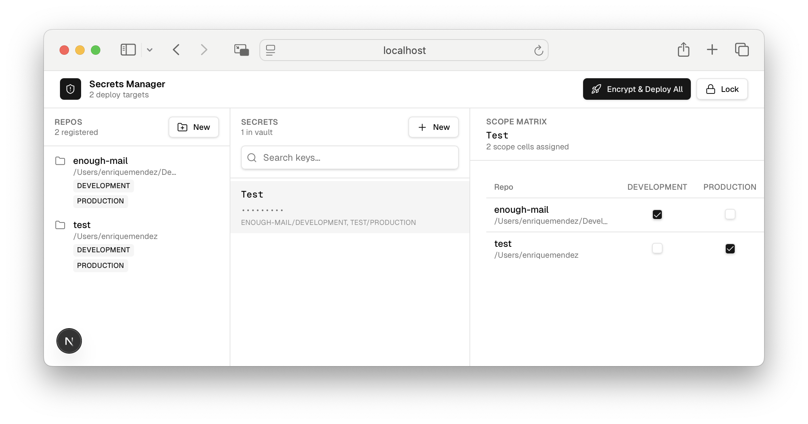

# Secrets Manager

A local-first secrets manager for many local repos. Define each key/value secret once, fan it out to any combination of `(repo × environment)`, and write encrypted `.env.<env>` files into each target repo. Drive it from the **web UI** or the **`sm` CLI** — the CLI is (as) AI-safe (as reasonably possible for a non-malicious agent) by design (it can do everything except read a plaintext value back out).

> **AI agents** — prefer the `sm-mcp` MCP server (advertised via the MCP tool schema and rendered into your client as tools). The `sm` CLI is also safe to call but does not surface the workflow guardrails (description-required, scope-after-add, dryRun-before-deploy) that [CLAUDE.md](./CLAUDE.md) prescribes. The two share a daemon, so the safety properties are identical; only the workflow scaffolding differs. See CLAUDE.md → "Why MCP, not CLI?" for the rationale.
>
> **Claude Code users** — install the [`secrets-manager` skill](./skills/secrets-manager/SKILL.md) at `~/.claude/skills/secrets-manager/` so Claude triggers the right workflow even before `sm-mcp` is wired up (e.g. for the first-time setup walkthrough). Quick install: `cp -r skills/secrets-manager ~/.claude/skills/` (or symlink). The skill auto-triggers on secret / credential / `.env` / rotation language and also when any `mcp__secrets-manager__*` tool is in scope.



## What it does

- **Single encrypted vault** at `~/.config/secrets-manager/vault.enc` (AES-256-GCM, scrypt-derived key, master password).
- **Three-pane UI** — repos on the left, secrets in the middle, scope matrix on the right.
- **AI-safe CLI** — `sm` talks to a long-running daemon (`sm-daemon`) over a Unix socket. The daemon is the only place the master password is ever typed; the CLI never holds it. **There is no `sm get` / `sm reveal`** — to see a plaintext value, open the GUI.
- **Namespaces** — give a secret an optional `namespace` to distinguish two secrets that share the same key (e.g. one `API_KEY` for Stripe and another for SendGrid). Namespaces are vault-internal only — the env-var written to `.env.<env>` is always the bare key. Use the `find-shared` command if you want to share one secret value across multiple repos with different env-var names; namespaces are NOT a renaming mechanism.
- **Variants** — tag a secret with an optional `variant` (`test`, `staging`, `live`, …) and the daemon auto-scopes it into every `(repo, env)` whose env resolves to that variant via the vault's `envVariantMap`. Variants are orthogonal to namespaces: namespaces disambiguate same-keyed secrets in the vault; variants control which cells a secret lands in. Variants are also vault-internal — they never appear in the deployed `.env.<env>` file. Use `sm set-variant` to mutate the variant in place (re-runs auto-scope) and `sm env-variant set/unset` to manage the env→variant map.
- **Tutorials** — attach step-by-step instructions to a secret via `set_tutorial` so a human can fetch the value from a vendor dashboard or OAuth screen. While the value is missing, the secret is held as an `awaiting_value` placeholder that `deploy` filters out, so the sentinel never leaks into a `.env` file.
- **One-click "Encrypt & Deploy"** writes `.env.<env>` per target repo using [`@dotenvx/dotenvx`](https://dotenvx.com/) public-key encryption.
- **`dotenvx-ops` for key custody** — when a `(repo, env)` is missing a public key, we shell out to `dotenvx-ops keypair`. Private keys live armored on the dotenvx-ops server; this app never touches them.
- **Merge-safe** — unknown keys already in `.env.<env>` are left alone.
- **Not a runtime proxy** — `sm` writes encrypted `.env.<env>` files at scope/deploy time. Your workload reads them via `dotenvx run`; plaintext never transits `sm` at workload runtime. If you arrived here expecting an Agent-Vault-style request proxy, this is a different shape.

## Run the GUI

```bash
pnpm install
pnpm dev
```

Open http://localhost:3000 — create a master password on first run, then start adding repos and secrets.

Requires:
- Node 20+
- `dotenvx-ops` CLI on `PATH` for keypair provisioning (`brew install dotenvx-ops` or see [dotenvx.com](https://dotenvx.com/)).
- An active `dotenvx-ops login` session for the *first* deploy to a `(repo, env)` pair that doesn't yet have a public key.

## Without dotenvx-ops

`sm deploy` works without the `dotenvx-ops` binary. When `dotenvx-ops` is missing or not logged in, secrets-manager generates a keypair in-process via the bundled `@dotenvx/dotenvx` SDK, writes the public key to `.env.<env>`, and stores the private key under `~/.config/secrets-manager/keys/<repo>-<hash>/<env>.private.key` with mode `0600`. To enforce `dotenvx-ops` (e.g. for teams), set `SM_REQUIRE_DOTENVX_OPS=1`.

## Run the CLI (`sm` + `sm-daemon`)

The CLI lives in [`bin/`](bin/) and runs through `tsx` (no compile step — both files carry a `#!/usr/bin/env -S npx tsx` shebang). Install once with the provided script:

```bash
# from the repo root
pnpm install          # install deps (once)
sudo ./install.sh     # creates symlinks in /usr/local/bin (re-running is safe)
```

To remove the symlinks:

```bash
sudo ./uninstall.sh
```

To install to a custom prefix instead of `/usr/local/bin`:

```bash
sudo SM_BIN_DIR=/opt/homebrew/bin ./install.sh
```

### Daemon lifecycle

The daemon holds the unlocked vault key in memory. **You** start it once; AI agents never invoke `daemon-start`.

```bash
sm-daemon start          # interactive — prompts for the master password (no echo)
sm-daemon status         # AI-safe — running|stopped + idle-TTL remaining
sm-daemon stop           # zero key, unlink socket, exit
```

- Socket: `${vaultDir()}/sm.sock` (perms `0600`).
- Idle-locks after 60 min by default — set `SM_DAEMON_IDLE_TTL_MIN` to override.
- Auto-locks and exits if the vault file is re-encrypted with a different password (you'll see `KEY_INVALID_AFTER_RELOAD`); restart with the new password.

### CLI surface

```
# Read-only
sm list-repos
sm list-secrets [--namespace NS]
sm list-scopes
sm describe-secret <key|id>
sm find-shared [--min-length N]

# Structural mutations
sm add-repo --name NAME --path PATH --env ENV...
sm remove-repo <id|name>
sm set-repo-envs <id|name> --env ENV...
sm update-repo-path <repo> --path PATH      # use after a git mv / worktree move
sm scope    <secret> --repo REPO --env ENV [--env ENV ...]
sm unscope  <secret> --repo REPO --env ENV
sm set-namespace <secret> --namespace NS   # or --unset
sm set-variant   <secret> --variant V      # or --unset (mutates in place + re-runs auto-scope)
sm rename-secret <secret> --new-key NEW

# Env-variant map (controls add-secret --variant auto-scoping)
sm env-variant list
sm env-variant set   --env ENV --variant V [--repo REPO]
sm env-variant unset --env ENV [--repo REPO]

# Value-bearing mutations — value handoff is via temp file, never argv
sm add-secret --key KEY [--namespace NS] [--variant V] --value-from-file PATH
sm set-value  <secret> --value-from-file PATH
sm remove-secret <id|key>

# Import / deploy
sm import --repo PATH [--env ENV] [--dry-run] [--default-namespace NS] [--default-variant V] [--on-conflict skip|overwrite|fail]
sm deploy [--repo REPO] [--env ENV] [--dry-run]
```

Every command emits `{ ok, ... }` JSON (default on non-TTY) and exits non-zero on failure. Responses **never** include a `value` field — three test suites (`tests/cli/never-emits-value`, `tests/daemon/protocol-shape`, `tests/cli/no-long-strings`) lock that invariant at the protocol level.

### Writing a value safely

The plaintext never crosses the socket — the CLI hands the daemon a file path:

```bash
# write to a temp file with 0600 perms, then point at it
umask 077
printf '%s' "$MY_SECRET_VALUE" > /tmp/v.txt
sm add-secret --key DATABASE_URL --namespace gmail --value-from-file /tmp/v.txt
rm /tmp/v.txt
```

For AI-driven workflows the **user** writes the temp file; the AI just hands the path to `sm`.

## Test

```bash
pnpm test        # 150 unit + integration tests across 20 files
pnpm typecheck
```

## Layout

```
app/
  unlock/        — master-password create + enter flow
  page.tsx       — the workbench (three-pane UI)
  actions.ts     — server actions: repo/secret CRUD, scope toggle, deploy

bin/
  sm.ts          — `sm` CLI entrypoint (subcommand router)
  sm-daemon.ts   — `sm-daemon` lifecycle (start/stop/status)

lib/
  vault/         — crypto, encrypted-file storage, session, zod schema, schema migration
  deploy/        — dotenvx integration (per-repo .env.<env> writer)
  cli/           — argv parsing, IPC client, subcommand handlers
  daemon/        — Unix-socket server, handler registry, password prompt, paths, mtime reload

components/      — UI components (workbench, panes, dialogs, deploy sheet)
tests/           — vitest suites: vault, deploy, import, daemon, cli, integration
.planning/       — frozen SPEC.md / SPEC-v0.2-cli.md and the matching PLANs
```

## Threat model

- **In scope:** plaintext secret values are protected at rest. Central vault is unreadable without the master password. Committed `.env.<env>` files are unreadable without the matching armored private key held by `dotenvx-ops`. **The CLI cannot exfiltrate a plaintext value** — by construction, the daemon has no code path that serializes `Secret.value` to the socket, and the verbs that would expose it (`get`, `cat`, `reveal`, `export`) do not exist.
- **Out of scope:** defending against a process running on the user's machine while the app is unlocked; shoulder-surfing; multi-user; memory protection beyond what Node gives for free.

See [`.planning/SPEC.md`](.planning/SPEC.md) and [`.planning/SPEC-v0.2-cli.md`](.planning/SPEC-v0.2-cli.md) for the full design contracts.
# secrets-manager
